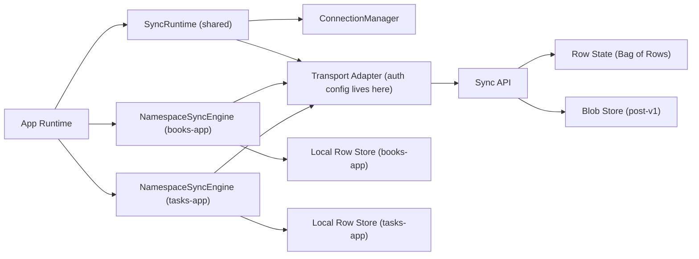

# RFC-0001: Core Architecture For A Two-Plane Sync Engine

- Status: Draft
- Author(s): <you>
- Reviewers: <tbd>
- Created: 2026-02-15
- Target Release: Prototype in Q2 2026
- Related Issues: N/A
- Supersedes: N/A
- Requires: N/A

## 1. Summary

This RFC proposes a sync engine with a narrow scope and an opinionated default experience. The v1 scope is **row sync first** (structured Bag of Rows), with files intentionally deferred until row sync is stable. The core architectural decision is to separate **session concerns** (connection, auth, transport) from **data concerns** (rows, files, conflict handling, GC). The primary differentiator is developer ergonomics for new apps: define schema once, use hook-first APIs for reads/writes, and let sync happen in the background.

## 2. Context And Problem Statement

### 2.1 Current State

General-purpose sync engines are powerful but often require developers to absorb broad concepts before they can ship basic offline-first behavior. In many product teams, this increases adoption time and integration risk.

### 2.2 Problem

We want a sync engine that is easier to adopt for new applications while still handling practical sync realities:

- Multiple devices per user
- Offline edits and reconnect
- Conflict handling
- Large file support
- Serverless deployment constraints

### 2.3 Why Existing Options Are Not Enough

Existing systems often optimize for broader problem spaces than needed here (federation, advanced query processing, broad permission topologies, or deep protocol complexity). This RFC focuses on a narrower product surface: personal/user-owned data sync with excellent defaults.

## 3. Goals

- G1. Offline-first by default; all app reads/writes are local.
- G2. Simple adoption path for new apps with low setup complexity.
- G3. Efficient incremental sync for rows with one durable server-issued cursor plus targeted accelerator pulls.
- G4. Works with serverless runtimes where persistent WebSockets may be unavailable.
- G5. Clear inspection/debuggability of sync state.
- G6. Namespaced storage so one sync backend can store multiple app domains for a user.

## 4. Non-Goals

- NG1. Fine-grained row-level sharing permissions between users.
- NG2. Federated social protocol interoperability.
- NG3. Rich server-side query execution over sync state.
- NG4. Drop-in migration for arbitrary existing app databases in v1.
- NG5. First-party file sync in v1.

## 5. Scope, Assumptions, And Constraints

- Users: single-user data ownership model per account namespace.
- Platforms: web first; extensible to mobile/desktop.
- Runtimes: serverless-compatible request/response APIs are required.
- Conflict model: default LWW with HLC; no vector clocks in v1.
- Clock assumption: moderate skew tolerated; tie-breaker resolves deterministic order.
- Identity model: user ID is derived server-side from auth context; client sends namespace only.
- Local DB: IndexedDB-first adapter on web (Dexie optional, not required).
- File store: object storage (for example R2/S3-compatible), targeted after row-sync GA.

## 6. Terminology

- **Bag of Rows**: A canonical row envelope format used for all logical collections.
- **Collection**: A logical table name in the app schema.
- **HLC**: Hybrid Logical Clock used for conflict ordering.
- **Tombstone**: Soft-delete marker retained for convergence and GC safety.
- **Cursor**: Server-issued sync token used for incremental pull and pagination.
- **Global Cursor**: Durable per-client cursor token for full incremental pull.
- **Accelerator Pull**: Filtered pull (collection and optional parent) that does not advance the durable global cursor.
- **Client Watermark**: Oldest global cursor acknowledged by a device/client.
- **Namespace**: Partition key, usually derived from app and user scope.
- **Op Log**: Persistent outbound mutation queue for retry and idempotency.
- **Sync State**: Persistent client replication state (cursor, clock, retry/backoff, ack markers).

## 7. Proposal

### 7.1 Architecture Overview

The architecture uses a shared runtime/session layer and namespace-scoped sync engines.



### 7.2 Module Boundaries

| Module              | Responsibility                                                                        | Inputs                                                     | Outputs                                                 |
| ------------------- | ------------------------------------------------------------------------------------- | ---------------------------------------------------------- | ------------------------------------------------------- |
| SyncRuntime         | Shared connection/transport lifecycle for all active namespaces                       | app lifecycle, connectivity signals                        | runtime connection state + transport IO                 |
| ConnectionManager   | Connection state machine, retry, pause/resume                                         | transport errors, visibility, connect requests             | current connection state                                |
| TransportAdapter    | HTTP/WebSocket abstraction; owns auth credential attachment                           | sync requests, auth config (cookie mode or token callback) | protocol frames/responses + auth error signals          |
| NamespaceSyncEngine | Push/pull rows for one namespace, own cursor/op-queue, HLC stamping, changefeed hints | local ops, runtime state, remote changes, HLC service      | local row state + namespace cursor + invalidation hints |
| RowStoreAdapter     | Local transactional reads/writes with LWW conflict resolution                         | StoredRows (already HLC-stamped)                           | write outcomes (which rows won LWW)                     |
| FileSyncEngine      | Upload/download blobs, maintain file manifest (post-v1)                               | file intents, row references                               | local file availability                                 |
| Inspector API       | Debugging and observability                                                           | local state, queue metadata, pull/push trace summary       | tooling endpoints/views                                 |

### 7.3 Separation Principle

Transport and connection code must be reusable regardless of what data plane or namespace is synced. Auth is configuration on the transport, not a separate layer — cookies work by default (via `credentials: 'include'`), and bearer tokens are opt-in via a token callback passed to the transport factory. Namespace engines consume runtime state and transport; they do not own connection or auth primitives.

### 7.4 Namespace Topology

- Single-namespace apps should instantiate one `NamespaceSyncEngine` and expose namespace-free repositories/hooks to app code.
- Multi-namespace apps (for example cross-app viewers/admin tools) can instantiate one engine per active namespace and compose results at the app layer.
- Namespace fanout should be explicit and bounded; avoid hidden per-view engine creation.
- Durable state (cursor/op-queue/retry markers) is per namespace; transport connection state is shared.

## 8. Data Model

### 8.1 Bag Of Rows Model

Canonical row envelope:

```json
{
  "namespace": "books-app",
  "collection": "todos",
  "id": "todo_123",
  "value": {
    "title": "Buy milk",
    "done": false
  },
  "parentID": null,
  "serverTimestampMs": 1760000000123,
  "hlc": "1740000000000-3-deviceA",
  "tombstone": false,
  "updatedBy": "deviceA",
  "txID": "tx_456"
}
```

`user_id` is not part of the client row envelope. It is derived on the server from auth context and stored as a separate partition column.

### 8.2 Required Internal Metadata

- `hlc`
- `tombstone`
- `updatedBy`
- `txID` (optional but recommended)
- `schemaVersion` (migration compatibility checks)
- `parentID` (optional, for targeted collection/entity pulls)
- `serverTimestampMs` (server-assigned ordering timestamp for sync cursor)

### 8.3 Server Ordering Model

Rows are ordered for pull using server-assigned timestamp plus deterministic tie-break:

| Field             | Type           | Notes                               |
| ----------------- | -------------- | ----------------------------------- |
| serverTimestampMs | int64          | set by server when a write wins LWW |
| namespace         | string         | Partition scope                     |
| collection        | string         | Logical table                       |
| id                | string         | Row id                              |
| parentID          | string or null | optional parent/entity selector     |
| hlc               | string         | conflict ordering                   |
| deviceID          | string         | deterministic tie-breaker           |
| txID              | string         | optional group marker               |

Stable pull ordering key:

- `(serverTimestampMs ASC, collection ASC, id ASC)`

### 8.4 File Model

File metadata is stored in rows; binary content is stored in blob storage.

| Field     | Type   | Notes                                  |
| --------- | ------ | -------------------------------------- |
| fileID    | string | app-level identifier                   |
| blobKey   | string | object-store key                       |
| hash      | string | content hash for verification          |
| sizeBytes | int64  | quota and transfer planning            |
| mimeType  | string | hint for consumers                     |
| status    | enum   | pending, uploaded, referenced, deleted |
| refCount  | int    | optional GC optimization               |

### 8.5 Server Schema Baseline (D1/SQLite)

Runtime does not require Drizzle. V1 ships SQL migrations and raw-query reference implementations.

Current state table:

- Primary key: `(user_id, namespace, collection, id)`
- Required indexes:
  - `(user_id, namespace)` for user+app isolation
  - `(user_id, namespace, collection)` for collection scans
  - `(user_id, namespace, server_timestamp_ms, collection, id)` for global pulls and pagination
  - `(user_id, namespace, collection, parent_id, server_timestamp_ms, id)` for targeted detail loads

No server change-log table is required in v1.

## 9. Sync Protocol

### 9.1 Push API

`POST /sync/push`

```json
{
  "clientID": "deviceA",
  "mutationID": 42,
  "txID": "tx_456",
  "ops": [
    {
      "kind": "upsert",
      "namespace": "books-app",
      "collection": "todos",
      "id": "todo_123",
      "value": {
        "title": "Buy milk"
      },
      "hlc": "1740000000000-3-deviceA"
    }
  ]
}
```

Server guarantees:

- Idempotent by `(clientID, mutationID)`
- All-or-nothing apply for ops in one request
- User partition is derived from auth context, not request body

### 9.2 Pull API

`GET /sync/pull?namespace=books-app&cursor=<opaque-token>&limit=1000`

```json
{
  "changes": [],
  "nextCursor": "<opaque-token>",
  "hasMore": false
}
```

Targeted accelerator pull:

`GET /sync/pull?namespace=books-app&cursor=<opaque-token>&collection=highlights&parentID=book_123&limit=500`

Semantics:

- `cursor` is server-issued. Client persists server-returned cursor tokens, not locally synthesized timestamps.
- No `collection`/`parentID` filter means **global pull** (durable cursor advancement).
- With filter means **accelerator pull** (does not advance durable global cursor).
- Ordering is deterministic by `(serverTimestampMs, collection, id)`.
- Pagination is represented by `nextCursor`; client can persist it after each page to resume safely.
- For accelerator pulls, `nextCursor` is continuation state for that filtered session and should not replace the durable global cursor.

Cursor token payload (opaque to client) contains at least:

- `sinceTsMs`: lower bound from last committed global sync
- `upperBoundTsMs`: query window upper bound
- `after`: optional `(serverTimestampMs, collection, id)` continuation position

### 9.3 Notifications

- Required: client-initiated polling pull loop.
- Optional: WebSocket or SSE signal to accelerate pull.
- Rule: correctness must not depend on persistent socket.

### 9.4 Cursor Retention

- Base model has no change-log retention cursor expiry because pulls run against current row state.
- If tombstones are hard-deleted with finite retention, stale clients may require rebase/snapshot.
- Optional server behavior: return `cursor_expired` when `sinceTsMs` predates tombstone retention safety window.

### 9.5 Cursor Strategy: One Durable Global Cursor + Accelerator Pulls

- Cursor is anchored on server timestamp windows, not client clocks.
- On each pull, server determines `upperBoundTsMs`:
  - if matching rows exist: max matching `serverTimestampMs` in the evaluated window
  - if none: query-start server timestamp
- Client persists one durable global cursor token per namespace in `sync_state`.
- Filtered pulls are allowed for priority UX and can use the same global cursor as the starting point.
- Filtered pulls are non-durable: they do not advance the persisted global cursor.
- Replays are acceptable and safe because row apply is idempotent.

Recommended scheduler:

- App startup: optionally run targeted pull for critical collection (for example `books`).
- Steady state: run global pull loop and advance durable global cursor.
- Detail navigation: optionally run targeted pull for large child sets (for example `highlights` with `parentID=bookID`).
- Global loop can be briefly deprioritized but should not be starved indefinitely.

Why this shape in v1:

- Single durable cursor keeps retention and recovery simple.
- Per-table/per-entity durable cursors create state explosion and harder GC/watermark logic.
- Targeted pulls preserve fast UX for first paint and deep detail screens without complicating durable state.

### 9.6 Backend Implementation Notes (Hono + D1)

- Provide framework-agnostic sync core plus thin Hono route adapters for `/sync/push` and `/sync/pull`.
- Raw SQL is acceptable and expected in v1 reference implementation.
- Drizzle integration is optional for teams that want typed migrations.
- On successful LWW apply, server updates `server_timestamp_ms` from server clock.
- Conflict apply uses UPSERT with compare-and-set semantics on HLC tuple and deterministic device tie-break:
  - `ON CONFLICT (...) DO UPDATE ... WHERE incoming_hlc > existing_hlc OR (incoming_hlc = existing_hlc AND incoming_device_id > existing_device_id)`

## 10. Conflict Resolution

### 10.1 Default Policy

- Compare by `hlc`, then by `deviceID` for deterministic tie-break.
- Winner becomes canonical row state.

Recommended HLC storage:

- Store HLC as columns (`hlc_wall_ms`, `hlc_counter`, `hlc_device_id`) instead of relying on string sort.
- This keeps SQL compare logic explicit and avoids fixed-width string encoding requirements.

Device ID generation:

- Generate `deviceID` once per client install/profile (UUID/ULID).
- Persist locally and reuse across sessions.
- Use in HLC tie-break and mutation idempotency identity.

### 10.2 Why Not Vector Clocks In v1

- Device set is unbounded.
- Metadata and operational overhead increase with active devices.
- Target scope prioritizes simpler predictable semantics.

### 10.3 Text Fields

Decision for v1:

- Use LWW for all fields, including text.
- Add per-field CRDT extension points later.

### 10.4 HLC Counter Overflow

- Counter width can be implementation-defined (for example 16-bit).
- On overflow at same wall time, increment logical wall time and reset counter.
- This keeps HLC monotonic without requiring oversized counters.

## 11. Deletes And Garbage Collection

### 11.1 Row Deletes

- Public delete API is logical delete (`remove`) only.
- `remove` appends a tombstone op with fresh HLC and queues it for push.
- Tombstone and HLC metadata are stored inline in the canonical internal row store.
- Local row is removed from normal app reads immediately (hooks never expose tombstoned rows unless explicitly requested for debugging).

### 11.2 Hard Delete GC

Physical deletion allowed only when:

- Tombstone age exceeds retention threshold.
- Optional: all active clients in namespace have cursors newer than tombstone `server_timestamp_ms`.

Client hard delete is not exposed in v1.

### 11.3 File GC

- Out of scope for row-sync v1.
- Planned behavior: file blobs become GC-eligible when unreferenced and beyond grace period.

## 12. Transactions

- Client batches operations into a `txID`.
- Server applies batch atomically inside one push request.
- Pull emits resulting row changes ordered by `(serverTimestampMs, collection, id)`.
- Cross-request distributed transactions are out of scope in v1.

### 12.1 Engine Transaction Contract

The engine exposes two transactional entrypoints: `txn` for local operations and `applyRemote` for server-pulled rows.

```ts
type RowStoreOperation =
  | { kind: "get_all"; collection: string }
  | { kind: "get"; collection: string; id: string }
  | { kind: "get_all_with_parent"; collection: string; parentID: string }
  | { kind: "put"; collection: string; id: string; value: unknown; parentID?: string | null }
  | { kind: "delete"; collection: string; id: string }
  | { kind: "delete_all_with_parent"; collection: string; parentID: string };

interface RowStoreTxnResult {
  txID: string;
  readResults: RowStoreReadResult[];
  writes: Array<{
    collection: string;
    id: string;
    hlc: HybridLogicalClock;
    tombstone: boolean;
  }>;
  invalidationHints: Array<{
    collection: string;
    id?: string;
    parentID?: string;
  }>;
}

interface ApplyRemoteResult {
  appliedCount: number;
  invalidationHints: Array<{
    collection: string;
    id?: string;
    parentID?: string;
  }>;
}
```

Execution rules:

- `txn`: dispatch reads and collect write intents in one adapter transaction. Allocate HLCs via `nextBatch(writeCount)` outside the adapter transaction. Apply writes in a second adapter transaction using `applyRows`, which handles LWW conflict resolution.
- `applyRemote`: rows already carry HLCs from the server. Apply in a single adapter transaction using `applyRows`.
- Resolve set-based writes (for example `delete_all_with_parent`) to concrete row IDs within the planning transaction.
- For delete operations, write tombstones rather than hard delete.
- Storage adapters own LWW conflict resolution: compare incoming HLC against existing row, write only if incoming wins.
- Storage adapters control physical tombstone encoding (for example `1/0` in Dexie for index-friendly fields).
- Both paths publish invalidation hints to subscribers after successful writes.

## 13. Local Storage Strategy

### 13.1 Adapter Interfaces

- `RowStoreAdapter`: transactional reads/writes with LWW conflict resolution via `applyRows`. Returns write outcomes so the engine can derive invalidation hints.
- `OpLogAdapter`: append/pending mutation tracking.
- `SyncStateAdapter`: durable replication state (global cursor token, local HLC state, retry/backoff state, ack markers).
- `FileStoreAdapter`: local blob cache + metadata manifest (post-v1).

### 13.2 IndexedDB And SQLite

V1 on web:

- Canonical IndexedDB adapter (Dexie-friendly layout).
- One canonical `rows` store (bag-of-rows source of truth) with internal sync metadata inline.
- One canonical `op_log` store (outbound mutations pending or in-flight).
- One canonical `sync_state` store (durable cursor token and engine state).
- Inline metadata in `rows` avoids join-like reads across stores and reduces drift risk.
- Keep write-path consistency by applying row change + op_log enqueue + invalidation in one local transaction.
- Do not add a separate "synced vs unsynced rows" table in v1.

### 13.3 Dirty Flag And Mutation Tracking

- `op_log` is the source of truth for pending/outstanding sync work.
- `dirty` may exist as a derived optimization hint on rows but must not replace `op_log`.
- Why: `op_log` preserves ordering, retries, idempotency keys, and crash-safe recovery semantics.
- If `dirty` is used, it should be set/cleared only by transaction code that also updates `op_log`.

Future:

- Optional SQLite adapter for heavier local query patterns.
- Optional materialized/derived stores for proven read-performance hotspots.

## 14. Developer Experience

### 14.1 Schema Definition

- Define schema once in Zod.
- Generate:
  - runtime validators
  - typed collection helpers
  - mutation input types

### 14.2 API Surface (Draft)

```ts
// Default: cookie-based auth (zero config — browser sends session cookie automatically)
const sync = createSyncEngine({
  schema,
  namespace: appName,
  rowStore: indexedDBAdapter(),
  mode: "strict",
  pullPolicy: {
    enableAcceleratorPulls: true,
  },
  transport: httpTransport({ baseURL }),
});

// Bearer token auth (opt-in for environments where cookies don't work)
const sync = createSyncEngine({
  schema,
  namespace: appName,
  rowStore: indexedDBAdapter(),
  mode: "strict",
  transport: httpTransport({
    baseURL,
    auth: { type: "bearer", token: () => getAccessToken() },
  }),
});
```

Hook-first usage:

```ts
const books = useSyncQuery({
  collection: "books",
  where: { archived: false },
});

const updateBook = useSyncMutation("books.updateByID");
const removeBook = useSyncMutation("books.removeByID");

await updateBook.mutateAsync({ id: "book_1", patch: { title: "Dune Messiah" } });
await removeBook.mutateAsync({ id: "book_1" });
```

### 14.3 React Integration

V1 recommendation:

- React Query is the public cache boundary.
- All `useSyncQuery` reads are served from local `rows` store.
- `useSyncMutation` applies local-first writes (optimistic by construction), enqueues `op_log`, and emits coalesced invalidations.
- App code does not need per-hook optimistic-update or invalidation boilerplate.
- `queryKey` is optional for app code; engine provides deterministic default keys from query shape.

Future option:

- Built-in `useLiveQuery` helpers as a thin wrapper once event patterns stabilize.

### 14.4 CRUD Wrapper And Delete Enforcement

- Generated collection repositories are the default write path (`insert`, `update`, `remove`).
- Generated defaults are ID-centric for writes (`updateByID`, `removeByID`) to reduce ambiguity.
- Repository writes always do three things in one local transaction:
  - apply local row change (optimistic by construction)
  - append op-log entry for push
  - emit invalidation event
- `remove` is the only delete primitive exposed in generated repositories and always creates a tombstone.
- Engine modes:
  - `strict` mode: raw local-DB handles are not exposed to app code.
  - `adoption` mode: legacy direct writes can be intercepted and normalized while migrating to strict mode.

### 14.5 React Query Invalidation Mapping

- RowStore owns invalidation event emission through a local changefeed.
- `NamespaceSyncEngine` and generated repositories both write through `RowStore.txn`, so local and remote applies share one invalidation path.
- React integration provides default key mapping (`[collection]`) and supports custom key mappers.
- Invalidation events are coalesced per microtask tick to avoid N invalidations for one transaction.
- This removes per-hook optimistic/invalidation boilerplate; hooks only call repository methods and subscribe to query keys.

### 14.6 Parent ID Semantics

- `parentID` is intended for one-to-many targeting (for example `highlights` by `bookID`).
- It is a sync fetch hint, not a full relational query language.
- Collections without one-to-many access patterns can omit `parentID`.

### 14.7 Composing Relational Views In Hooks

- `useSyncQuery` should focus on primitive reads (`get_all`, `get`, `get_all_with_parent`).
- Joins/compositions should be built as app-level custom hooks by combining multiple `useSyncQuery` calls.
- Example: a `useBookWithHighlights(bookID)` hook composes one book query and one highlights-by-parent query, then returns merged view data.
- Because invalidation is driven by RowStore changefeed hints, updates to either side re-run the composed hook.

## 15. Security And Privacy

- Default cookie-based auth relies on `httpOnly` + `secure` session cookies managed by the auth provider (e.g. Better Auth). The sync engine never sees or stores the token.
- Bearer token mode: the app-provided `token` callback is invoked per-request by the transport. The sync engine does not persist tokens; token lifecycle is the app's responsibility.
- Transport surfaces auth errors (e.g. 401) as typed events; the runtime's connection state machine decides whether to pause sync and notify the app.
- File uploads use scoped URLs/tokens with TTL.
- Per-namespace auth boundary enforced server-side.
- Redact sensitive payloads from logs by default.

## 16. Observability And Tooling

### 16.1 Metrics

- queue depth
- mutation retry count
- pull latency
- time-to-converge
- transport auth error rate (401/403 responses)
- cursor rebase rate
- accelerator replay ratio

### 16.2 Inspector

Provide a local inspector surface for:

- rows by namespace/collection
- pending local mutations
- current global cursor and watermark
- current cursor window (`sinceTsMs`, `upperBoundTsMs`) for active pulls
- accelerator pull activity (collection and optional parent filters)
- file manifest status (post-v1)

### 16.3 Logging Policy

Default production logs (always on):

- push/pull summaries: namespace, request/response counts, latency, retry reason, error class
- cursor progress summaries: previous/next cursor tokens (opaque), pull window metadata, has-more loops
- queue health: op-log depth, oldest pending age, backoff state
- apply summaries: collection and row IDs changed, tombstone counts

Debug logs (opt-in only):

- redacted payload snapshots for push/pull and apply
- bounded local ring buffer for recent traces to support bug reports
- explicit scrub rules for secret and sensitive fields

## 17. Performance And Cost

### 17.1 Encoding Choice

V1 uses JSON protocol frames for simplicity and debuggability.

Trade-off:

- Pros: easy debugging, low integration complexity.
- Cons: larger payloads than binary.

Plan:

- Re-evaluate binary encoding once baseline metrics exist.

### 17.2 Incremental Efficiency

- Cursor-based pull keeps steady-state transfer small.
- Periodic compaction reduces scan and storage overhead.

## 18. Alternatives Considered

### 18.1 Full-Scope Existing Sync Engine

- Pros: mature feature set.
- Cons: broader concepts and adoption overhead than this product scope.

### 18.2 AT Protocol-Based Sync

Useful ideas:

- cursor/backfill discipline
- content-addressed blob handling

Why not directly adopt:

- federation/repo semantics and protocol complexity exceed v1 goals
- this project does not need public network interoperability in scope

### 18.3 Per-Table Durable Cursors And Per-Table Local Stores

- Pros: direct mapping to app schema and potentially simpler targeted fetch logic.
- Cons: cursor/state explosion, heavier retention accounting, and more migration complexity.

Decision:

- Keep canonical bag-of-rows envelope plus one durable server-issued global cursor token in v1.

## 19. Rollout Plan

- Phase 0: local-only row engine with mutation log and inspector.
- Phase 1: row push/pull, LWW/HLC merge, tombstones, one durable global cursor token.
- Phase 2: accelerator pulls (collection and parent filters), timestamp window pagination, production observability.
- Phase 3: file upload/download + manifest sync.

Exit criteria:

- Offline edits converge across 3+ devices in tests.
- Deterministic conflict outcomes under clock skew simulation.
- Rebase flow works without data loss when tombstone retention window is exceeded.
- Critical first-paint collection sync reaches target SLA under cold start via accelerator pull.

## 20. Testing Plan

- Unit:
  - state machine transitions
  - HLC ordering and tie-break
  - idempotent mutation replay
- Integration:
  - transport auth error (401) -> connection pause -> app re-auth -> reconnect
  - duplicate/out-of-order push requests
  - pull pagination and cursor handoff
- Resilience:
  - random network partitions
  - delayed/reordered notifications
  - long offline windows with GC pressure

## 21. Risks And Mitigations

| Risk                                               | Impact | Likelihood | Mitigation                                                                     |
| -------------------------------------------------- | ------ | ---------- | ------------------------------------------------------------------------------ |
| Clock skew causes surprising wins/losses           | High   | Medium     | HLC + deterministic tie-break + skew alerts                                    |
| Tombstone retention too short                      | High   | Medium     | watermark-based hard-delete gate + grace period                                |
| Cursor rebase too frequent                         | Medium | Medium     | retention tuning + snapshot fallback                                           |
| Overusing accelerator pulls causes replay overhead | Medium | Medium     | keep global loop primary + track replay ratio + throttle accelerator frequency |
| DX still feels complex                             | High   | Medium     | narrow API + starter template + inspector first                                |

## 22. Open Questions

| ID  | Question                                                                     | Owner | Target Date | Decision Criteria                         | Status                        |
| --- | ---------------------------------------------------------------------------- | ----- | ----------- | ----------------------------------------- | ----------------------------- |
| Q1  | Should CRDT text fields be in v1 or v2?                                      | <tbd> | 2026-02-16  | product need vs complexity budget         | Resolved: v2                  |
| Q2  | Should metadata fields be publicly readable by default?                      | <tbd> | 2026-02-16  | accidental misuse risk vs debugging value | Resolved: internal-by-default |
| Q3  | Is canonical JSON enough or do we need binary before GA?                     | <tbd> | 2026-04-01  | payload size and CPU benchmarks           | Open                          |
| Q4  | Should local SQLite adapter be part of v1 scope?                             | <tbd> | 2026-03-15  | measured IndexedDB bottlenecks            | Open                          |
| Q5  | Do we need a first-party `useLiveQuery` in v1?                               | <tbd> | 2026-02-16  | React Query invalidation ergonomics       | Resolved: no                  |
| Q6  | Should the cursor token remain opaque forever or expose a typed debug shape? | <tbd> | 2026-03-10  | debugging ergonomics vs API stability     | Open                          |
| Q7  | Should parent filters be schema-generated or manually declared?              | <tbd> | 2026-03-25  | correctness vs developer control          | Open                          |
| Q8  | Should a row-level `dirty` flag replace `op_log` as pending-sync truth?      | <tbd> | 2026-02-16  | crash recovery and retry correctness      | Resolved: no                  |
| Q9  | Should invalidation ownership live in SyncEngine or RowStore?                | <tbd> | 2026-02-16  | single-path consistency for local/remote  | Resolved: RowStore            |
| Q10 | Should each namespace have an isolated sync engine instance?                 | <tbd> | 2026-02-16  | app ergonomics vs state complexity        | Resolved: yes                 |

## 23. Decision Log

| Date       | Decision                                                               | Rationale                                                                                                                                                                                                                                  | Consequence                                                                                                     |
| ---------- | ---------------------------------------------------------------------- | ------------------------------------------------------------------------------------------------------------------------------------------------------------------------------------------------------------------------------------------ | --------------------------------------------------------------------------------------------------------------- |
| 2026-02-15 | Two-plane architecture (rows + files)                                  | Matches data shape and performance needs                                                                                                                                                                                                   | Independent evolution of structured and blob sync                                                               |
| 2026-02-15 | Session layer is separate from data layer                              | Better reuse and testability                                                                                                                                                                                                               | Cleaner boundaries and simpler testing                                                                          |
| 2026-02-15 | LWW with HLC default                                                   | Predictable, low complexity conflict model                                                                                                                                                                                                 | Some collaborative text scenarios need future CRDT extension                                                    |
| 2026-02-15 | Tombstone-first deletes                                                | Required for convergence and safe GC                                                                                                                                                                                                       | Additional storage and compaction complexity                                                                    |
| 2026-02-15 | HTTP correctness path, socket optional                                 | Serverless compatibility                                                                                                                                                                                                                   | Slightly higher pull latency without push channel                                                               |
| 2026-02-15 | React Query integration first                                          | Fast adoption and familiar tooling                                                                                                                                                                                                         | Need invalidation discipline                                                                                    |
| 2026-02-16 | Row sync prioritized for v1; files deferred                            | Reduces scope and de-risks initial release                                                                                                                                                                                                 | Faster path to stable core protocol                                                                             |
| 2026-02-16 | One durable server-issued cursor token with filtered accelerator pulls | Preserves simple durable state while enabling priority sync paths                                                                                                                                                                          | Replayed rows can increase apply volume                                                                         |
| 2026-02-16 | Hook-first strict API boundary                                         | Prevents invalid local writes and repeated optimistic/invalidation boilerplate                                                                                                                                                             | Direct local DB querying is intentionally constrained                                                           |
| 2026-02-16 | Inline internal metadata in canonical rows store                       | Avoids row/meta drift and join-like local reads                                                                                                                                                                                            | Slightly larger row payload in local storage                                                                    |
| 2026-02-16 | Cursor ordering uses `(serverTimestampMs, collection, id)`             | Deterministic pagination without separate commit sequence                                                                                                                                                                                  | Requires stable index and server-issued cursor tokens                                                           |
| 2026-02-16 | Shared `SyncRuntime` + per-namespace `NamespaceSyncEngine`             | Keeps app APIs namespace-light while preserving isolation of durable sync state                                                                                                                                                            | Multi-namespace apps compose engines explicitly                                                                 |
| 2026-02-16 | `op_log` remains authoritative; `dirty` is optional derived hint       | Guarantees ordering/retry/idempotency and crash-safe replay semantics                                                                                                                                                                      | Slightly more local metadata than a `dirty`-only approach                                                       |
| 2026-02-16 | Engine owns invalidation via changefeed hints                          | Unifies local writes and remote apply invalidation semantics                                                                                                                                                                               | Hooks depend on engine event contract                                                                           |
| 2026-02-16 | Engine `txn` accepts discriminated union ops and returns typed result  | Single write path with deterministic HLC assignment and clear invalidation map                                                                                                                                                             | Adapter implementations must support set-op expansion                                                           |
| 2026-02-16 | LWW conflict resolution pushed into adapters                           | Adapters can use native conflict handling (SQLite ON CONFLICT, IndexedDB bulkGet)                                                                                                                                                          | Engine apply phase is a single `applyRows` call; adapters own conflict semantics                                |
| 2026-02-16 | Engine exposes `applyRemote` for server-pulled rows                    | Clean separation of local writes (need HLC allocation) from remote applies (HLCs already present)                                                                                                                                          | Two distinct write paths through same adapter `applyRows` contract                                              |
| 2026-02-16 | `AuthLayer` removed; auth is transport configuration                   | Auth is mechanically tied to transport (cookies via fetch options, bearer via headers, WS via query params). Separate layer creates a seam that doesn't earn its keep. Follows Better Auth's model: cookies are default, bearer is opt-in. | Transport owns credential attachment + auth error signaling; runtime owns policy (pause/resume on auth failure) |

## 24. Appendix A: Initial Defaults

- Scope: row sync first in v1, file sync deferred.
- Conflict resolution: LWW with HLC + device tie-break.
- Auth: cookie-based by default (zero config); bearer token opt-in via transport config.
- Transport: HTTP push/pull required, socket notifications optional. Auth credential attachment is transport-owned.
- Deletes: soft-delete tombstones, hard-delete after watermark gate.
- Text fields: LWW in v1.
- Metadata fields: internal by default, debug/advanced opt-in.
- Cursor model: one durable server-issued global cursor token plus non-durable filtered accelerator pulls.
- Pull ordering: `(serverTimestampMs, collection, id)` with timestamp window upper bounds.
- Transactions: atomic per push request.
- Runtime topology: one shared `SyncRuntime` with per-namespace sync engines.
- Local mutation tracking: authoritative `op_log`; optional derived `dirty` hint only.
- Invalidation: emitted by RowStore changefeed hints, consumed by hook/query integration.
